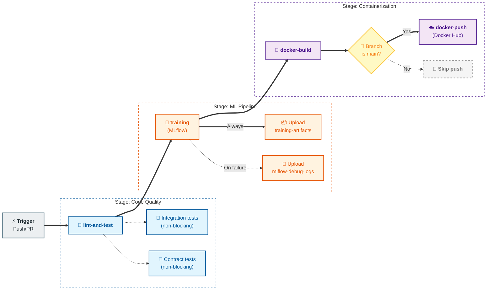

# MLOps Group 8 — Credit Score Classification

Multiclass credit score classifier (Poor / Standard / Good) with a full MLOps stack: training pipeline, batch scoring, drift monitoring, FastAPI serving, web UI, Docker packaging, CI/CD, and Prometheus/Grafana observability.

---

## Quick Start (local)

```bash
# 1. Install dependencies
pip install -r requirements.txt

# 2. Set up MLflow for experiment tracking and model registry (must be running before training)
mlflow server --host 127.0.0.1 --port 5000 --backend-store-uri sqlite:///.temp/mlflow_db/mlflow.db --default-artifact-root .temp/mlruns

# 2. Train the model (generates artifacts/ and data/processed/)
python -m src.pipelines.training_pipeline

# 3. Start the API + web UI
uvicorn deployment.fastapi.main:app --host 0.0.0.0 --port 8000
```

Open <http://localhost:8000/ui/> in your browser.

---

## Quick Start (Docker Compose)

```bash
# Build and start all services (API, MLflow, Prometheus, Grafana)
docker compose up --build

# Services:
#   API + Web UI  → http://localhost:8000
#   MLflow UI     → http://localhost:5000
#   Prometheus    → http://localhost:9090
#   Grafana       → http://localhost:3000  (admin / admin)
```

---

## Project Structure

```bash
MLOps-Group-8/
│
├── 📊 src/                             # Core ML application code
│   ├── data/
│   │   ├── ingestion.py               # Load raw CSV → DataFrame
│   │   ├── schema.py                  # Define & validate data schema
│   │   ├── validation.py              # Data quality checks
│   │   ├── preprocessing.py           # Cleaning, encoding, transformation
│   │   └── split.py                   # Train/val/test split logic
│   │
│   ├── features/
│   │   ├── build_features.py          # Feature pipeline orchestration
│   │   ├── engineering.py             # Domain-specific feature creation
│   │   ├── selection.py               # Feature importance & selection
│   │   ├── encoders.py                # Categorical encoding strategies
│   │   ├── imputers.py                # Missing value handling
│   │   └── selectors.py               # Feature subset selection
│   │
│   ├── models/
│   │   ├── train.py                   # LightGBM, XGBoost, RF training
│   │   ├── ensemble.py                # Soft voting ensemble
│   │   ├── evaluate.py                # Metrics (F1, AUC, fairness, etc)
│   │   ├── calibrate.py               # Probability calibration
│   │   ├── predict.py                 # Single/batch inference
│   │   ├── serialize.py               # ModelBundle serialization
│   │   └── registry.py                # MLflow + local registry integration
│   │
│   ├── pipelines/
│   │   ├── training_pipeline.py       # Full pipeline: HPO → ensemble → registry
│   │   ├── hyperparameter_tuning_pipeline.py  # Optuna HPO
│   │   ├── scoring_pipeline.py        # Batch inference + drift detection
│   │   ├── retraining_pipeline.py     # Drift-gated retraining
│   │   ├── deployment_pipeline.py     # Pre-deployment validation
│   │   └── validation_pipeline.py     # Cross-validation & stability checks
│   │
│   ├── serving/
│   │   ├── decision_policy.py         # Business logic (confidence thresholds)
│   │   └── latency_monitor.py         # Track request latencies
│   │
│   ├── monitoring/
│   │   ├── input_monitor.py           # Input data quality & distribution
│   │   ├── output_monitor.py          # Prediction distribution monitoring
│   │   └── drift_monitor.py           # Drift detection (PSI, KS test)
│   │
│   ├── risk/
│   │   └── psi.py                     # Population stability index
│   │
│   └── utils/
│       ├── logger.py                  # Structured logging
│       └── io.py                      # File I/O helpers
│
├── 🚀 deployment/
│   ├── fastapi/                       # REST API + Web UI server
│   │   ├── main.py                    # FastAPI app & lifespan handler
│   │   ├── service.py                 # InferenceBackendService (singleton)
│   │   ├── config.py                  # AppConfig (env vars, paths)
│   │   ├── mlflow_resolver.py         # Model resolution chain
│   │   ├── schemas.py                 # Request/response Pydantic models
│   │   ├── metrics.py                 # Prometheus instrumentation
│   │   ├── web.py                     # Web UI routes & templates
│   │   ├── requirements.txt           # FastAPI-specific deps
│   │   ├── README.md                  # API documentation
│   │   ├── tests/                     # API endpoint tests
│   │   ├── static/                    # CSS, JavaScript files
│   │   └── templates/                 # Jinja2 HTML templates
│   │
│   └── k8s/                           # Kubernetes manifests (kind cluster)
│       ├── kind-config.yaml           # Kind cluster configuration
│       ├── namespace.yaml             # credit-score namespace
│       ├── configmap.yaml             # MLflow URI, model name config
│       ├── pvc.yaml                   # Persistent volume claim for artifacts
│       ├── api-deployment.yaml        # API Deployment (2 replicas, init container)
│       ├── api-service.yaml           # ClusterIP Service
│       ├── hpa.yaml                   # HorizontalPodAutoscaler (CPU 50%, mem 70%)
│       └── helm-values.yaml           # Prometheus/Grafana Helm config
│
├── 📈 monitoring/                     # Prometheus & Grafana config
│   ├── prometheus/
│   │   └── prometheus.yml             # Scrape endpoints, retention policy
│   └── grafana/
│       ├── dashboards/                # Pre-built dashboard JSON
│       └── provisioning/              # Datasource & dashboard auto-provisioning
│
├── 📦 artifacts/                      # Training outputs (generated)
│   ├── models/
│   │   ├── final_model_bundle.pkl     # Latest production model
│   │   ├── model_bundle.pkl           # Previous model
│   │   ├── serving_model_bundle.pkl   # K8s pre-baked model
│   │   ├── model_registry.json        # Local model registry (fallback)
│   │   └── train_metadata.json        # Training metadata
│   │
│   ├── reports/
│   │   ├── final_model_comparison.csv # Final model ranking
│   │   ├── final_model_selection.json # Selected model info
│   │   ├── eval_train.json            # Training metrics
│   │   ├── eval_valid.json            # Validation metrics
│   │   ├── eval_test_final.json       # Test metrics (final)
│   │   ├── calibration_report.json    # Probability calibration
│   │   ├── fairness_report.csv        # Fairness metrics by group
│   │   ├── fairness_summary.json      # Fairness summary
│   │   ├── feature_importance_rf.csv  # Random Forest feature importance
│   │   ├── feature_importance.csv     # Model-agnostic importance
│   │   ├── shap_feature_importance.csv # SHAP values
│   │   ├── best_hyperparameters.json  # Best Optuna trial params
│   │   ├── top3_tuning_results.csv    # Top 3 tuning trials
│   │   ├── model_ranking.csv          # All model rankings
│   │   ├── model_ranking.md           # Rankings in markdown
│   │   ├── powerbi_*.csv              # PowerBI dashboards input
│   │   └── figures/                   # Plots & diagrams
│   │
│   ├── predictions/
│   │   └── sample_predictions.csv     # Batch prediction outputs
│   │
│   └── drift_reports/
│       └── powerbi_drift_summary.csv  # Drift detection results
│
├── 💾 data/
│   ├── raw/
│   │   ├── train_raw.csv              # Original training data
│   │   └── test_raw.csv               # Original test data
│   │
│   ├── processed/
│   │   ├── train_split.csv            # Processed training set
│   │   ├── valid_split.csv            # Processed validation set
│   │   └── test_split.csv             # Processed test set
│   │
│   ├── interim/                       # Intermediate data (temp)
│   │
│   └── reference/
│       └── category_sets.json         # Reference categorical values
│
├── 🧪 tests/
│   ├── unit/                          # Unit tests (fast, no deps)
│   ├── integration/                   # Integration tests (need model bundle)
│   └── smoke/                         # Smoke tests (quick sanity checks)
│
├── 📚 docs/
│   ├── architecture.md                # System design & data flow
│   ├── api_spec.md                    # REST API reference
│   ├── runbook.md                     # Operational guide (training, deployment)
│   ├── windows-setup.md               # Windows setup with Chocolatey
│   └── git_workflow.md                # Git conventions & PR workflow
│
├── 📋 configs/
│   └── base.yaml                      # Project configuration (paths, model params)
│
├── 📖 notebooks/
│   ├── 01_eda.ipynb                   # Exploratory data analysis
│   ├── 02_feature_analysis.ipynb      # Feature importance & correlation
│   ├── 03_model_experiments.ipynb     # Model comparison & tuning
│   └── 04_error_analysis.ipynb        # Prediction error analysis
│
├── 📝 scripts/
│   ├── generate_traffic.py            # Generate test requests for monitoring
│   └── _patch_notebooks.py            # Internal notebook patching
│
├── 🔄 mlruns/                         # MLflow local tracking (generated)
│   ├── 0/                             # Default experiment
│   └── 194323661774503133/            # Credit score experiment
│
├── 🐳 Container & orchestration
│   ├── Dockerfile                     # Multi-stage build (API runtime)
│   ├── Dockerfile.model               # Lightweight model image (K8s)
│   ├── docker-compose.yml             # Local dev stack (API + MLflow + Prometheus + Grafana)
│   ├── .dockerignore                  # Docker build exclusions
│   └── Makefile                       # K8s deployment shortcuts
│
├── 📦 Dependencies
│   ├── requirements.txt                # Production dependencies
│   ├── requirements-dev.txt            # Dev/test dependencies
│   ├── .env                            # Environment variables (not in repo)
│   └── .env.example                    # Environment template
│
├── 🔧 Configuration & CI/CD
│   ├── .github/
│   │   └── workflows/
│   │       └── ci.yml                 # GitHub Actions: lint → test → train → docker
│   ├── .gitignore                     # Git exclusions
│   ├── .ruff.toml                     # Ruff linter config
│   └── README.md                      # This file
│
└── 📑 Version control
    └── .git/                          # Git repository
```

### Key Architecture Patterns

- **Singleton Model Service**: `InferenceBackendService` ensures single model instance per process
- **MLflow-First Resolution**: Production relies on MLflow for model discovery (fallback to JSON)
- **Pre-Baked K8s Models**: K8s uses InitContainer to pre-load model, avoiding MLflow dependency during startup
- **Feature Pipeline**: Consistent preprocessing for training, batch scoring, and online inference
- **Modular Pipelines**: Each pipeline (training, scoring, retraining) is independently testable & configurable

---

## Training Pipeline

```bash
# Full training (HPO → ensemble → evaluation → registry)
python -m src.pipelines.training_pipeline

# Hyperparameter tuning only
python -m src.pipelines.hyperparameter_tuning_pipeline \
    --trials 100 --timeout 3600 --models lightgbm xgboost

# Batch scoring
python -m src.pipelines.scoring_pipeline
python -m src.pipelines.scoring_pipeline --input path/to/new_data.csv --no-drift

# Drift-gated retraining
python -m src.pipelines.retraining_pipeline
python -m src.pipelines.retraining_pipeline --force
python -m src.pipelines.retraining_pipeline --new-data path/to/new_data.csv
```

---

## API Endpoints

| Method | Path | Description |
| -------- | ------ | ------------- |
| GET | `/health` | Liveness + model version |
| GET | `/model-info` | Full model metadata (JSON) |
| POST | `/predict` | Single-record prediction |
| POST | `/predict/batch` | Batch prediction |
| GET | `/metrics` | Prometheus metrics |
| GET | `/ui/` | Home page |
| GET | `/ui/predict` | Web prediction form |
| GET | `/ui/monitor` | Monitoring dashboard |
| GET | `/docs` | Swagger UI |

### Example prediction

```bash
curl -X POST http://localhost:8000/predict \
  -H "Content-Type: application/json" \
  -d '{
    "Age": 34,
    "Annual_Income": 78000,
    "Monthly_Inhand_Salary": 5200,
    "Num_Bank_Accounts": 4,
    "Num_Credit_Card": 3,
    "Interest_Rate": 12,
    "Outstanding_Debt": 1200,
    "Credit_Mix": "Good",
    "Payment_of_Min_Amount": "Yes"
  }'
```

---

## Monitoring & Observability

### Prometheus metrics (scraped from `/metrics`)

| Metric | Type | Description |
| -------- | ------ | ------------- |
| `credit_score_requests_total` | Counter | Requests by endpoint + status |
| `credit_score_request_latency_ms` | Histogram | Latency in ms by endpoint |
| `credit_score_predictions_by_class_total` | Counter | Predictions by class label |
| `credit_score_model_loaded` | Gauge | 1 if model loaded, 0 otherwise |
| `credit_score_batch_size` | Histogram | Records per batch request |

### Grafana dashboard

Pre-provisioned at <http://localhost:3000> → **Credit Score API** dashboard.  
Panels: total predictions, error rate, request rate, p50/p95/p99 latency, class distribution pie.

---

## Kubernetes Deployment

This section covers deploying the Credit Score API to a local Kubernetes cluster using **kind** on Windows.

### ⚙️ Windows Setup with Chocolatey

If you're on Windows and don't have the required tools, use Chocolatey to install them quickly.

#### Step 0: Install Chocolatey (if needed)

Open **PowerShell as Administrator** and run:

```powershell
Set-ExecutionPolicy Bypass -Scope Process -Force; [System.Net.ServicePointManager]::SecurityProtocol = [System.Net.ServicePointManager]::SecurityProtocol -bor 3072; iex ((New-Object System.Net.WebClient).DownloadString('https://community.chocolatey.org/install.ps1'))
```

Verify installation:

```powershell
choco --version
```

#### Step 1: Install required tools via Chocolatey

```powershell
# Install Docker Desktop (includes Docker & Docker Compose), skip if you already have it
choco install docker-desktop -y

# Install Kubernetes tools (ignore dependency warnings if Docker Desktop is already installed)
choco install kind --ignore-dependencies -y

# Install Make (required for Makefile commands)
choco install make -y

# (Optional) Install Helm for monitoring stack
choco install kubernetes-helm -y
```

Verify all tools are installed:

```powershell
docker --version
docker compose version
kubectl version --client
kind --version
make --version
```

#### Step 2: Start Docker Desktop

Open **Docker Desktop** from Start menu and wait for it to fully initialize (watch the system tray icon).

Verify Docker is running:

```powershell
docker ps
```

---

### 🚀 Quick K8s Deployment with Make

The **Makefile** simplifies the entire deployment workflow into a single command.

#### Option A: Full deployment from scratch

```powershell
make all
```

This single command:

1. Creates a local kind cluster with proper configuration
2. Loads your Docker images into the cluster
3. Applies all Kubernetes manifests (namespace, config, PVC, deployment, service, HPA)
4. Waits for Pods to be Ready
5. Shows cluster status

**Expected output:**

```bash
Deployment "credit-score-api" successfully rolled out
NAME                            READY   STATUS    RESTARTS   AGE
pod/credit-score-api-xxx        2/2     Running   0          10s
pod/credit-score-api-yyy        2/2     Running   0          10s
svc/credit-score-api-service    ClusterIP   10.96.x.x   <none>   8000/TCP   5s
```

#### Option B: Check deployment status

```powershell
make status
```

Shows real-time status of all Pods, Services, HPA, and PVC in the credit-score namespace.

#### Option C: View API logs

```powershell
make logs
```

Streams logs from all API Pods. Press `Ctrl+C` to stop.

#### Option D: Open port-forward for local testing

```powershell
make web
```

Forwards local `http://localhost:8000` to the in-cluster API Service. Keep this terminal open.

In another terminal, test the API:

```powershell
curl http://localhost:8000/health
curl http://localhost:8000/docs        # Swagger UI
curl http://localhost:8000/ui/         # Web UI
```

#### Option E: Clean up everything

```powershell
make clean
```

Deletes the entire kind cluster and all resources. Use this to reset and start over.

---

### 🔧 Manual K8s Commands (for advanced users)

If you prefer fine-grained control, use kubectl directly:

#### Create namespace

```bash
kubectl apply -f deployment/k8s/namespace.yaml
```

#### Apply ConfigMap (MLflow tracking URI, model name, etc.)

```bash
kubectl apply -f deployment/k8s/configmap.yaml
```

#### Create persistent volume claim for artifacts

```bash
kubectl apply -f deployment/k8s/pvc.yaml
```

#### Deploy API (2 replicas, init container with model, health checks)

```bash
kubectl apply -f deployment/k8s/api-deployment.yaml
```

**Note on InitContainer strategy:**

- The Deployment uses an init container to provision the model from `ruoc188/ml-models:latest`
- The model is copied to a shared emptyDir volume mounted at `/app/models/`
- The API container reads the model from `/app/models/serving_model_bundle.pkl`
- This pre-baked approach avoids dynamic MLflow resolution in K8s for faster startup

#### Expose API with ClusterIP Service

```bash
kubectl apply -f deployment/k8s/api-service.yaml
```

#### Enable horizontal autoscaling

```bash
kubectl apply -f deployment/k8s/hpa.yaml
```

Automatically scales the API deployment based on CPU and memory usage.

#### Wait for rollout to complete

```bash
kubectl -n credit-score rollout status deploy/credit-score-api --timeout=180s
```

#### View all resources

```bash
kubectl -n credit-score get pods,svc,hpa,pvc
```

#### Stream logs from all API Pods

```bash
kubectl -n credit-score logs -f deploy/credit-score-api
```

#### Port-forward to test locally

```bash
kubectl -n credit-score port-forward svc/credit-score-api 8000:8000
```

Then open:

- **Swagger UI**: <http://127.0.0.1:8000/docs>
- **Web UI**: <http://127.0.0.1:8000/ui/>
- **Health**: <http://127.0.0.1:8000/health>
- **Model info**: <http://127.0.0.1:8000/model-info>

#### Cleanup

```bash
kubectl delete -f deployment/k8s/hpa.yaml --ignore-not-found
kubectl delete -f deployment/k8s/api-service.yaml
kubectl delete -f deployment/k8s/api-deployment.yaml
kubectl delete -f deployment/k8s/pvc.yaml --ignore-not-found
kubectl delete -f deployment/k8s/configmap.yaml
kubectl delete -f deployment/k8s/namespace.yaml
```

---

### 📋 Kubernetes Architecture

**Deployment strategy:**

```bash
kind Cluster
  └─ credit-score namespace
     ├─ credit-score-api Deployment
     │  ├─ InitContainer: ruoc188/ml-models:latest
     │  │  └─ Copies serving_model_bundle.pkl to emptyDir
     │  └─ API Container: ruoc188/mlops-group8:v1.0
     │     ├─ Mounts model from emptyDir at /app/models/
     │     ├─ Environment: USE_BAKED_MODEL=true
     │     ├─ Liveness probe: GET /health every 30s
     │     └─ Readiness probe: GET /health every 10s
     ├─ credit-score-api-service (ClusterIP)
     │  └─ Routes traffic to API Pods
     ├─ HPA (HorizontalPodAutoscaler)
     │  └─ Scales Pods based on CPU (50%) and memory (70%)
     └─ PVC for artifacts (optional, currently unused)
```

**Model resolution priority in K8s:**

1. Check `USE_BAKED_MODEL=true` and load from `/app/models/serving_model_bundle.pkl`
2. If baked model fails, fall back to MLflow (requires MLflow reachable inside cluster)

**Model resolution priority in local dev (Docker Compose):**

1. Try MLflow alias "production" → fetch from MLflow server
2. Fall back to JSON registry (`artifacts/models/model_registry.json`)
3. Fall back to fallback path (`MODEL_PATH_FALLBACK`)

---

### (Optional) Monitoring Stack with Helm

If you want Prometheus + Grafana for metrics:

```bash
# Add Prometheus Community Helm repo
helm repo add prometheus-community https://prometheus-community.github.io/helm-charts
helm repo update

# Install monitoring stack into monitoring namespace
helm install monitoring prometheus-community/kube-prometheus-stack \
  -n monitoring --create-namespace \
  -f deployment/k8s/helm-values.yaml
```

Access Grafana:

```bash
kubectl -n monitoring port-forward svc/monitoring-grafana 3000:80
```

Open <http://localhost:3000> (default: admin / prom-operator)

---

## CI/CD

GitHub Actions workflow at `.github/workflows/ci.yml` is triggered by:

- Push to `main` and `develop`
- Pull request targeting `main`

### Pipeline Stages

1.**lint-and-test**

- Sets up Python 3.11 and installs `requirements-dev.txt`
  - Runs Ruff lint on `src/` and `tests/`
  - Runs unit tests (blocking)
  - Runs integration and contract tests as non-blocking checks (`continue-on-error: true`)

2.**training** (depends on `lint-and-test`)

- Starts a local MLflow server in CI (`127.0.0.1:5000`)
  - Waits until MLflow is ready before training
  - Runs `python -m src.pipelines.training_pipeline`
  - Verifies required training outputs exist
  - Uploads artifacts bundle (`artifacts/models`, `artifacts/reports`, drift reports, predictions)
  - Uploads MLflow debug logs if the job fails

3.**docker-build** (depends on `training`)

- Downloads the uploaded training artifacts
  - Builds runtime Docker image with Buildx (no push)
  - Uses GitHub Actions cache for faster builds

4.**docker-push** (depends on `docker-build`, only on branch `main`)

- Logs in to Docker Hub using repository secrets
  - Builds and pushes runtime image tags:
    - `${{ secrets.DOCKERHUB_USERNAME }}/mlops-group8:latest`
    - `${{ secrets.DOCKERHUB_USERNAME }}/mlops-group8:${{ github.sha }}`

Required repository secrets for push job:

- `DOCKERHUB_USERNAME`
- `DOCKERHUB_TOKEN`

### CI/CD DAG



Notes:

- PRs to `main` run validation, training, and Docker build checks, but do not push images.
- Image publishing is automatic only for successful workflows on `main`.

---

## Tests

```bash
pytest tests/ -v --tb=short
pytest tests/unit/          # fast, no external deps
pytest tests/integration/   # needs model bundle
pytest tests/contract/      # needs running server
```

---

## Model Results (Ensemble Soft Voting, test set — 15k samples)

Production model: `credit_score_serving` (LightGBM)

| Metric | Value |
| -------- | ------- |
| F1 Macro | 0.7876 |
| Accuracy | 0.7959 |
| AUC (OVR) | 0.9154 |
| Precision Macro | 0.7786 |
| Recall Macro | 0.7987 |

---

## Documentation

| Document | Description |
| ---------- | ------------- |
| [docs/windows-setup.md](docs/windows-setup.md) | **Windows users**: Complete setup guide with Chocolatey for all tools (Docker, kubectl, kind, make) |
| [docs/architecture.md](docs/architecture.md) | System components, data flow, model resolution chain |
| [docs/api_spec.md](docs/api_spec.md) | REST API reference with request/response schemas |
| [docs/runbook.md](docs/runbook.md) | Operations guide: startup, retraining, troubleshooting |
| [docs/git_workflow.md](docs/git_workflow.md) | Branch strategy, commit conventions, PR workflow |
