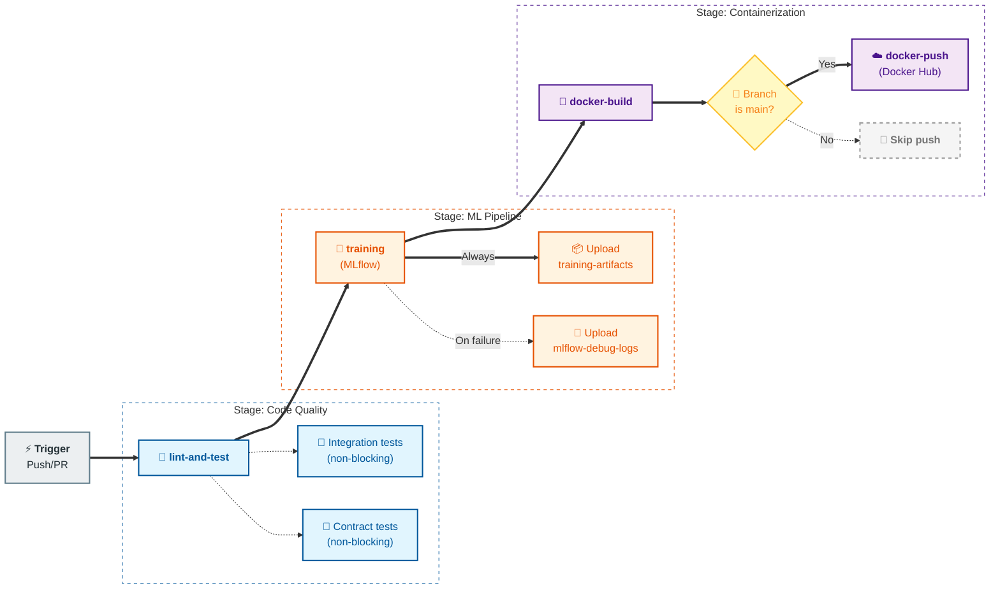

# MLOps Group 8 — Credit Score Classification

Multiclass credit score classifier (Poor / Standard / Good) with a full MLOps stack: training pipeline, batch scoring, drift monitoring, FastAPI serving, web UI, Docker packaging, CI/CD, and Prometheus/Grafana observability.

---

## Quick Start (local)

```bash
# 1. Install dependencies
pip install -r requirements.txt

# 2. Set up MLflow for experiment tracking and model registry (must be running before training)
mlflow server --host 127.0.0.1 --port 5000 --backend-store-uri sqlite:///.temp/mlflow_db/mlflow.db --default-artifact-root .temp/mlruns

# 2. Train the model (generates artifacts/ and data/processed/)
python -m src.pipelines.training_pipeline

# 3. Start the API + web UI
uvicorn deployment.fastapi.main:app --host 0.0.0.0 --port 8000
```

Open <http://localhost:8000/ui/> in your browser.

---

## Quick Start (Docker Compose)

```bash
# Build and start all services (API, MLflow, Prometheus, Grafana)
docker compose up --build

# Services:
#   API + Web UI  → http://localhost:8000
#   MLflow UI     → http://localhost:5000
#   Prometheus    → http://localhost:9090
#   Grafana       → http://localhost:3000  (admin / admin)
```

---

## Project Structure

```bash
├── src/
│   ├── data/           # Loading, schema, preprocessing
│   ├── features/       # Feature engineering, encoders, imputers
│   ├── models/         # Training, evaluation, serialization, registry
│   ├── pipelines/      # Training, scoring, retraining, HPO pipelines
│   ├── serving/        # Batch scoring, decision policy, latency monitor
│   ├── monitoring/     # Input/output/drift monitors
│   ├── risk/           # PSI computation
│   └── utils/          # Logger, IO helpers
├── deployment/
│   ├── fastapi/        # FastAPI app (main.py, service, schemas, web UI)
│   └── k8s/            # Kubernetes manifests
├── monitoring/
│   ├── prometheus/     # prometheus.yml scrape config
│   └── grafana/        # Datasource + dashboard provisioning
├── artifacts/
│   ├── models/         # Model bundle, registry JSON
│   └── reports/        # Evaluation, fairness, drift reports
├── data/
│   ├── raw/            # Source data
│   ├── processed/      # Train/val/test splits
│   └── reference/      # Reference distribution for drift checks
├── tests/              # unit / integration / contract tests
├── .github/workflows/  # CI/CD (lint, test, Docker build)
├── Dockerfile
└── docker-compose.yml
```

---

## Training Pipeline

```bash
# Full training (HPO → ensemble → evaluation → registry)
python -m src.pipelines.training_pipeline

# Hyperparameter tuning only
python -m src.pipelines.hyperparameter_tuning_pipeline \
    --trials 100 --timeout 3600 --models lightgbm xgboost

# Batch scoring
python -m src.pipelines.scoring_pipeline
python -m src.pipelines.scoring_pipeline --input path/to/new_data.csv --no-drift

# Drift-gated retraining
python -m src.pipelines.retraining_pipeline
python -m src.pipelines.retraining_pipeline --force
python -m src.pipelines.retraining_pipeline --new-data path/to/new_data.csv
```

---

## API Endpoints

| Method | Path | Description |
| -------- | ------ | ------------- |
| GET | `/health` | Liveness + model version |
| GET | `/model-info` | Full model metadata (JSON) |
| POST | `/predict` | Single-record prediction |
| POST | `/predict/batch` | Batch prediction |
| GET | `/metrics` | Prometheus metrics |
| GET | `/ui/` | Home page |
| GET | `/ui/predict` | Web prediction form |
| GET | `/ui/monitor` | Monitoring dashboard |
| GET | `/docs` | Swagger UI |

### Example prediction

```bash
curl -X POST http://localhost:8000/predict \
  -H "Content-Type: application/json" \
  -d '{
    "Age": 34,
    "Annual_Income": 78000,
    "Monthly_Inhand_Salary": 5200,
    "Num_Bank_Accounts": 4,
    "Num_Credit_Card": 3,
    "Interest_Rate": 12,
    "Outstanding_Debt": 1200,
    "Credit_Mix": "Good",
    "Payment_of_Min_Amount": "Yes"
  }'
```

---

## Monitoring & Observability

### Prometheus metrics (scraped from `/metrics`)

| Metric | Type | Description |
| -------- | ------ | ------------- |
| `credit_score_requests_total` | Counter | Requests by endpoint + status |
| `credit_score_request_latency_ms` | Histogram | Latency in ms by endpoint |
| `credit_score_predictions_by_class_total` | Counter | Predictions by class label |
| `credit_score_model_loaded` | Gauge | 1 if model loaded, 0 otherwise |
| `credit_score_batch_size` | Histogram | Records per batch request |

### Grafana dashboard

Pre-provisioned at <http://localhost:3000> → **Credit Score API** dashboard.  
Panels: total predictions, error rate, request rate, p50/p95/p99 latency, class distribution pie.

---

## Kubernetes Deployment

Run this flow when you already have the API image in local Docker and do not want to pull from Docker Hub.

### Prerequisites

- kubectl is installed and can connect to your cluster (`kubectl cluster-info`).
- Kubernetes is enabled (for example Docker Desktop Kubernetes).
- The image already exists locally (example: ruoc188/mlops-group8:latest).
- The Deployment should use local image behavior:
  - imagePullPolicy: IfNotPresent (or Never) in deployment/k8s/api-deployment.yaml.
- MLflow is reachable from inside the cluster at the URI in deployment/k8s/configmap.yaml.

### Step 0: Verify local image exists

```bash
docker image inspect ruoc188/mlops-group8:latest
```

Checks whether the API image is already in your local Docker cache. If no result appears, build it first:

```bash
docker build -t ruoc188/mlops-group8:latest .
```

Builds the image locally from this repository so Kubernetes can use it without pulling from a registry.

If your cluster is **Docker Desktop Kubernetes**, the local Docker image is usually visible directly.
If your cluster is **kind** or **minikube**, load the image into the cluster explicitly:

```bash
# kind
kind load docker-image ruoc188/mlops-group8:latest

# minikube
minikube image load ruoc188/mlops-group8:latest
```

### Step 1: Create namespace

```bash
kubectl apply -f deployment/k8s/namespace.yaml
```

Creates the credit-score namespace to isolate all project resources.

### Step 2: Create runtime config

```bash
kubectl apply -f deployment/k8s/configmap.yaml
```

Creates ConfigMap values injected into the API container, including MLflow tracking URI and model name.

### Step 3: (Optional) Create persistent volume claim

```bash
kubectl apply -f deployment/k8s/pvc.yaml
```

Creates a persistent volume claim for artifacts. Keep this step if your Pod mounts artifacts through PVC.

### Step 4: Deploy API

```bash
kubectl apply -f deployment/k8s/api-deployment.yaml
```

Creates or updates the API Deployment, including replicas, probes, resources, and image settings.

### Step 5: Expose API inside cluster

```bash
kubectl apply -f deployment/k8s/api-service.yaml
```

Creates a ClusterIP Service that provides stable in-cluster networking for the API Pods.

### Step 6: (Optional) Enable autoscaling

```bash
kubectl apply -f deployment/k8s/hpa.yaml
```

Creates HorizontalPodAutoscaler for CPU and memory based scaling. Requires metrics-server in the cluster.

### Step 7: Wait for rollout completion

```bash
kubectl -n credit-score rollout status deploy/credit-score-api --timeout=180s
```

Waits until new Pods are Ready and the Deployment rollout is complete.

### Step 8: Check current resources

```bash
kubectl -n credit-score get pods,svc,hpa,pvc
```

Shows runtime state of Pods, Service, autoscaler, and storage claim in one command.

### Step 9: Inspect logs when needed

```bash
kubectl -n credit-score logs deploy/credit-score-api --tail=200
```

Prints recent API logs for startup and model loading troubleshooting.

### Step 10: Open API locally via port-forward

```bash
kubectl -n credit-score port-forward svc/credit-score-api 8000:80
```

Forwards local port 8000 to the in-cluster Service so you can open API/UI from your machine.

After port-forward is running, open:

- API docs: <http://127.0.0.1:8000/docs>
- Web UI: <http://127.0.0.1:8000/ui/>
- Health: <http://127.0.0.1:8000/health>
- Model metadata: <http://127.0.0.1:8000/model-info>

### Cleanup (optional)

```bash
kubectl delete -f deployment/k8s/hpa.yaml --ignore-not-found
kubectl delete -f deployment/k8s/api-service.yaml
kubectl delete -f deployment/k8s/api-deployment.yaml
kubectl delete -f deployment/k8s/pvc.yaml --ignore-not-found
kubectl delete -f deployment/k8s/configmap.yaml
kubectl delete -f deployment/k8s/namespace.yaml
```

Removes all deployed Kubernetes resources in reverse order.

Optional monitoring stack:

```bash
helm repo add prometheus-community https://prometheus-community.github.io/helm-charts
```

Adds the official Prometheus Community chart repository to Helm.

```bash
helm repo update
```

Refreshes local Helm chart indexes so latest chart versions are available.

```bash
helm install monitoring prometheus-community/kube-prometheus-stack \
  -n monitoring --create-namespace \
  -f deployment/k8s/helm-values.yaml
```

Installs Prometheus + Grafana into the `monitoring` namespace using this project's custom values.

---

## CI/CD

GitHub Actions workflow at `.github/workflows/ci.yml` is triggered by:

- Push to `main` and `develop`
- Pull request targeting `main`

### Pipeline Stages

1.**lint-and-test**

- Sets up Python 3.11 and installs `requirements-dev.txt`
  - Runs Ruff lint on `src/` and `tests/`
  - Runs unit tests (blocking)
  - Runs integration and contract tests as non-blocking checks (`continue-on-error: true`)

2.**training** (depends on `lint-and-test`)

- Starts a local MLflow server in CI (`127.0.0.1:5000`)
  - Waits until MLflow is ready before training
  - Runs `python -m src.pipelines.training_pipeline`
  - Verifies required training outputs exist
  - Uploads artifacts bundle (`artifacts/models`, `artifacts/reports`, drift reports, predictions)
  - Uploads MLflow debug logs if the job fails

3.**docker-build** (depends on `training`)

- Downloads the uploaded training artifacts
  - Builds runtime Docker image with Buildx (no push)
  - Uses GitHub Actions cache for faster builds

4.**docker-push** (depends on `docker-build`, only on branch `main`)

- Logs in to Docker Hub using repository secrets
  - Builds and pushes runtime image tags:
    - `${{ secrets.DOCKERHUB_USERNAME }}/mlops-group8:latest`
    - `${{ secrets.DOCKERHUB_USERNAME }}/mlops-group8:${{ github.sha }}`

Required repository secrets for push job:

- `DOCKERHUB_USERNAME`
- `DOCKERHUB_TOKEN`

### CI/CD DAG



Notes:

- PRs to `main` run validation, training, and Docker build checks, but do not push images.
- Image publishing is automatic only for successful workflows on `main`.

---

## Tests

```bash
pytest tests/ -v --tb=short
pytest tests/unit/          # fast, no external deps
pytest tests/integration/   # needs model bundle
pytest tests/contract/      # needs running server
```

---

## Model Results (Ensemble Soft Voting, test set — 15k samples)

Production model: `ensemble_soft_voting` (LightGBM + XGBoost + Random Forest)

| Metric | Value |
| -------- | ------- |
| F1 Macro | 0.7876 |
| Accuracy | 0.7959 |
| AUC (OVR) | 0.9154 |
| Precision Macro | 0.7786 |
| Recall Macro | 0.7987 |

---

## Documentation

| Document | Description |
| ---------- | ------------- |
| [docs/architecture.md](docs/architecture.md) | System components, data flow, model resolution chain |
| [docs/api_spec.md](docs/api_spec.md) | REST API reference with request/response schemas |
| [docs/runbook.md](docs/runbook.md) | Operations guide: startup, retraining, troubleshooting |
| [docs/git_workflow.md](docs/git_workflow.md) | Branch strategy, commit conventions, PR workflow |
