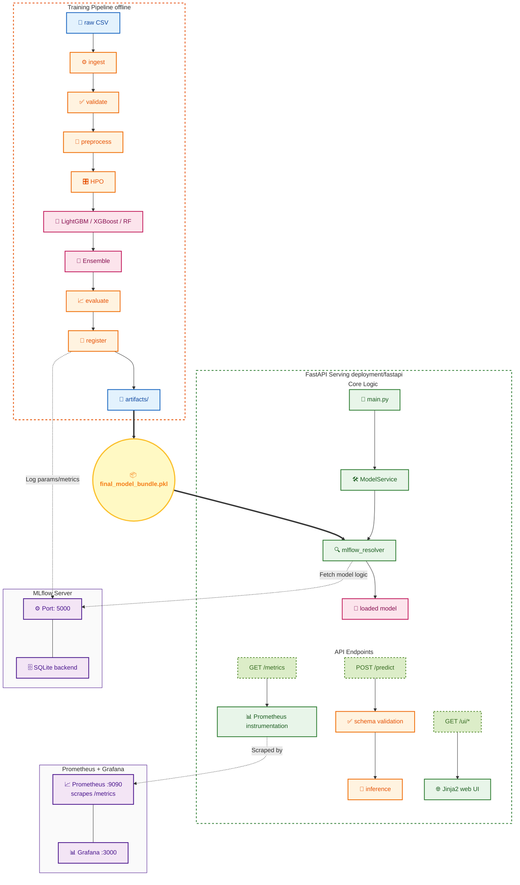

# Architecture

## System Overview

Credit Score Classification MLOps pipeline — trains a multiclass classifier (Poor / Standard / Good), serves predictions via FastAPI, and monitors model health with Prometheus/Grafana.



---

## Components

### Training Pipeline (`src/pipelines/training_pipeline.py`)

Runs end-to-end from raw CSV to registered model:

1. **Ingestion** (`src/data/ingestion.py`) — loads `data/raw/train.csv`
2. **Validation** (`src/data/validation.py`) — schema checks, missing-value stats
3. **Preprocessing** (`src/features/`) — encoding, imputation, capping, scaling
4. **HPO** (Optuna) — tunes LightGBM, XGBoost, Random Forest independently
5. **Ensemble** — soft-voting over the three tuned models (`src/models/ensemble.py`)
6. **Evaluation** — per-class F1, fairness report, PSI drift vs reference set
7. **Registration** — writes to `artifacts/models/model_registry.json` and mirrors to MLflow

### Model Registry

Two-tier:

| Tier | Location | Used when |
| ------ | ---------- | ----------- |
| MLflow | `mlruns/` (local) or `http://mlflow:5000` (Docker) | Production deployments |
| JSON fallback | `artifacts/models/model_registry.json` | Local dev, MLflow unavailable |

### Model Resolution Chain (`deployment/fastapi/mlflow_resolver.py`)

```bash
1. MLflow alias "Production" for MLFLOW_MODEL_NAME
        ↓ fail
2. MLflow stage "Production" for MLFLOW_MODEL_NAME
        ↓ fail / not found
3. JSON fallback — reads model_registry.json, picks "production" entry
```

All MLflow-unavailable warnings are filtered from the UI warning bar.

### FastAPI Application (`deployment/fastapi/`)

| File | Role |
| ------ | ------ |
| `main.py` | App factory, startup/shutdown, mounts routers |
| `service.py` | `ModelService` — loads model, runs inference, applies decision policy |
| `schemas.py` | Pydantic input/output models |
| `web.py` | Jinja2 routes (`/ui/*`), data loaders for monitor page |
| `mlflow_resolver.py` | 3-tier model resolution |
| `config.py` | `AppConfig` from environment variables |

### Monitoring

- **Prometheus** scrapes `/metrics` every 15s
- **Grafana** dashboard provisioned at startup from `monitoring/grafana/provisioning/`
- **Drift** computed via PSI against `data/reference/` — results in `artifacts/drift_reports/`
- **Fairness** report in `artifacts/reports/fairness_report.csv`

---

## Docker Topology

```bash
docker-compose.yml
├── api          (credit-score-api:latest, :8000)
│   ├── volumes: ./artifacts → /app/artifacts (ro)
│   │            ./data/reference → /app/data/reference (ro)
│   └── depends_on: mlflow
├── mlflow       (ghcr.io/mlflow/mlflow:v2.13.0, :5000)
│   ├── backend: sqlite:////mlflow/db/mlflow.db  (named volume mlflow_db)
│   └── artifacts: /mlflow/artifacts
├── prometheus   (prom/prometheus:v2.51.0, :9090)
└── grafana      (grafana/grafana:10.4.0, :3000)
```

---

## Data Flow

```bash
data/raw/train.csv
    └─ training_pipeline ──► data/processed/{train,valid,test}.parquet
                         ──► artifacts/models/final_model_bundle.pkl
                         ──► artifacts/reports/*.{json,csv}
                         ──► artifacts/drift_reports/*.csv
                         ──► mlruns/ (MLflow tracking)

POST /predict
    └─ ModelService.predict()
         ├─ PredictInput (Pydantic validation)
         ├─ feature engineering (same transformers as training)
         ├─ model.predict_proba()
         ├─ DecisionPolicy → decision + action
         └─ PredictResponse
```
