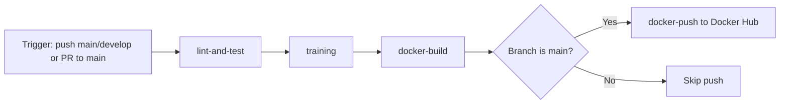

# Runbook

Operational guide for the Credit Score MLOps system.

---

## 🪟 Windows Users: Quick Start

If you're on **Windows**, see [**windows-setup.md**](./windows-setup.md) for a complete guide to install all tools via **Chocolatey**, then come back here.

TL;DR for Windows:

```powershell
# In Admin PowerShell
choco install docker-desktop kubectl kind make -y

# Then follow "Step 1" below
```

---

## End-to-End Run Order

Follow this sequence when setting up and running the project from scratch.

### Step 0: Tool list and environment checks

Required tools:

- Python 3.11
- pip
- Docker + Docker Compose
- kubectl (required for Kubernetes flow)
- Helm (optional, only for monitoring stack)

Check versions:

```bash
python --version
pip --version
docker --version
docker compose version
kubectl version --client
helm version
```

Why: confirms core tooling is available before running pipelines or containers.

### Step 1: Install dependencies

```bash
# Runtime dependencies
pip install -r requirements.txt

# Dev/test dependencies (recommended for full workflow)
pip install -r requirements-dev.txt
```

Why: installs packages for training, serving, testing, and CI parity.

### Step 2: Set up MLflow

Start MLflow locally before training:

```bash
mlflow server --host 127.0.0.1 --port 5000 --backend-store-uri sqlite:///mlflow.db
```

Why: training and model registration need a running MLflow tracking server.

Verify MLflow is reachable:

```bash
curl http://127.0.0.1:5000/
```

### Step 3: Run training pipeline

Run full training pipeline:

```bash
python -m src.pipelines.training_pipeline
```

Why: executes HPO -> ensemble -> evaluation -> model selection -> bundle export.

Expected artifacts:

- artifacts/models/final_model_bundle.pkl
- artifacts/reports/final_model_comparison.csv
- artifacts/reports/final_model_selection.json
- artifacts/drift_reports/

### Step 3.1: Hyperparameter tuning only (optional)

```bash
python -m src.pipelines.hyperparameter_tuning_pipeline \
        --trials 100 --timeout 3600 --models lightgbm xgboost
```

Why: runs search only, useful when you want to tune without full retraining/export.

### Step 3.2: Scoring pipeline (optional)

```bash
python -m src.pipelines.scoring_pipeline
python -m src.pipelines.scoring_pipeline --input path/to/new_data.csv --no-drift
```

Why: generates batch predictions and optional drift reports.

### Step 3.3: Retraining pipeline (optional)

```bash
python -m src.pipelines.retraining_pipeline
python -m src.pipelines.retraining_pipeline --force
python -m src.pipelines.retraining_pipeline --new-data path/to/new_data.csv
```

Why: supports drift-gated retraining or force retraining with new data input.

### Step 4: Run API and web UI locally

```bash
uvicorn deployment.fastapi.main:app --host 0.0.0.0 --port 8000 --reload
```

Why: starts FastAPI service and web pages for inference + monitoring views.

Open and test:

- Web UI: <http://localhost:8000/ui/>
- Swagger UI: <http://localhost:8000/docs>
- Health: <http://localhost:8000/health>
- Model metadata: <http://localhost:8000/model-info>

Quick API check:

```bash
curl -X POST http://localhost:8000/predict \
    -H "Content-Type: application/json" \
    -d '{
        "Age": 34,
        "Annual_Income": 78000,
        "Monthly_Inhand_Salary": 5200,
        "Num_Bank_Accounts": 4,
        "Num_Credit_Card": 3,
        "Interest_Rate": 12,
        "Outstanding_Debt": 1200,
        "Credit_Mix": "Good",
        "Payment_of_Min_Amount": "Yes"
    }'
```

### Step 5: Run with Docker Compose

First run (build everything):

```bash
docker compose up --build
```

Subsequent runs:

```bash
docker compose up -d
```

Why: first run builds API image; later runs reuse existing image/layers for faster startup.

View logs:

```bash
docker compose logs -f api
docker compose logs -f mlflow
```

Ports:

- API + Web UI: <http://localhost:8000>
- MLflow UI: <http://localhost:5000>
- Prometheus: <http://localhost:9090>
- Grafana: <http://localhost:3000> (default: admin / admin)

Stop services:

```bash
docker compose down
docker compose down -v
```

Set Grafana password:

```bash
cp .env.example .env
# Edit .env: set GRAFANA_PASSWORD=your_password
docker compose up -d grafana
```

---

## Kubernetes Deployment with Make

For detailed Kubernetes deployment instructions, **see README.md → "Kubernetes Deployment" section**.

### Quick Start (using Makefile)

```bash
# 1. Full deployment from scratch
make all

# 2. Port-forward to localhost:8000 (in a new terminal)
make web

# 3. Test the API
curl http://localhost:8000/health
open http://localhost:8000/docs

# 4. View logs
make logs

# 5. Cleanup when done
make clean
```

### Available Make Commands

| Command | Purpose |
| --------- | --------- |
| `make all` | Create cluster → deploy → show status |
| `make cluster` | Create kind cluster only |
| `make deploy` | Deploy manifests to existing cluster |
| `make status` | Show pods, services, HPA |
| `make logs` | Stream API logs |
| `make web` | Port-forward to localhost:8000 |
| `make clean` | Delete cluster |
| `make describe` | Show deployment details |
| `make events` | Show recent events |
| `make shell` | Open shell in API pod |

### For Manual kubectl Commands

If you prefer fine-grained control, see the detailed manual steps in **README.md → "Manual K8s Commands"**.

---

## CI/CD Summary (Same as README)

Workflow file: .github/workflows/ci.yml

Triggers:

- Push to main and develop
- Pull request targeting main

Job DAG:

1. lint-and-test
2. training (needs lint-and-test)
3. docker-build (needs training)
4. docker-push (needs docker-build, main branch only)

Mermaid DAG:



---

## Run Tests Manually

```bash
pytest tests/ -v --tb=short
pytest tests/unit/
pytest tests/integration/
pytest tests/contract/
```

---

## Promoting a New Model

After training completes, the best model is automatically registered and promoted to `production` in `artifacts/models/model_registry.json`.

To manually promote:

```python
from src.models.registry import promote_to_production
promote_to_production("ensemble_soft_voting", "1.0.0")
```

Restart the API to pick up the new model:

```bash
# Local
Ctrl+C and restart uvicorn

# Docker
docker compose restart api
```

---

## Checking Model Info

```bash
# JSON endpoint
curl http://localhost:8000/model-info | python -m json.tool

# Health check
curl http://localhost:8000/health
```

---

## Checking Logs

```bash
# Local (stdout)
uvicorn ... 2>&1 | tee server.log

# Docker
docker compose logs api --tail=100 -f
docker compose logs mlflow --tail=50
```

---

## Common Issues

### Warning bar shows MLflow messages

The warning bar on `/ui/` filters known MLflow fallback messages. If a new message type appears:

1. Note the exact message text
2. Add a fragment to `_MUTED_WARNING_FRAGMENTS` in `deployment/fastapi/web.py`
3. Restart the server

### Model loads but predictions seem wrong

Check which model is active:

```bash
curl http://localhost:8000/model-info | python -m json.tool
# Look at "source_resolved_from" and "model_name"
```

Expected: `model_name = "ensemble_soft_voting"`, `source_resolved_from = "json_fallback"` (local) or `"mlflow_alias_production"` (Docker with registered alias).

If it shows `"lightgbm"` unexpectedly, verify `artifacts/models/model_registry.json` has `"production": {"model_name": "ensemble_soft_voting", "version": "1.0.0"}`.

### model_registry.json shows absolute Windows path

This was a known bug (now fixed in `src/models/registry.py`). If encountered, manually edit `model_registry.json`:

```json
"artifact_path": "artifacts/models/final_model_bundle.pkl"
```

### Docker healthcheck failing

The healthcheck requires `curl` in the image. Verify the Dockerfile runtime stage includes:

```dockerfile
RUN apt-get update && apt-get install -y --no-install-recommends curl \
    && rm -rf /var/lib/apt/lists/*
```

### Docker image too large

Check `.dockerignore` is present in the repo root. Verify `mlruns/` is excluded (it can be 1+ GB). Expected image size: < 2GB after excluding notebooks/plotting packages.

### MLflow SQLite backend (Docker only)

MLflow uses SQLite at `/mlflow/db/mlflow.db` (persisted in named volume `mlflow_db`). The `mlruns/` directory is still mounted for artifact access but is no longer the backend store.

If you need to reset the MLflow database:

```bash
docker compose down
docker volume rm mlops-group-8_mlflow_db
docker compose up -d mlflow
```

---

## Drift Monitoring

Drift reports are generated by the scoring pipeline and stored in `artifacts/drift_reports/`. The monitor page at `/ui/monitor` reads `powerbi_drift_summary.csv`.

PSI threshold: > 0.2 triggers a retraining recommendation.

Reference distribution: `data/reference/reference_data.parquet`
